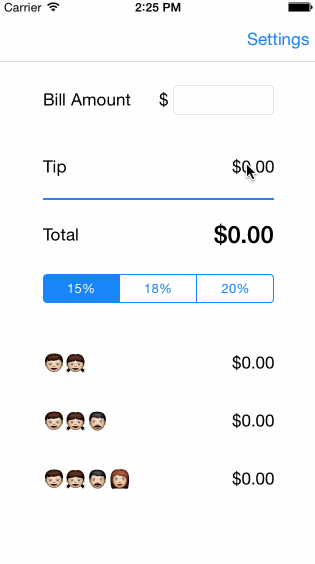

### iOS (Swift) tip calculator

#### How many hours did it take to complete?

About four hours.

#### Which required and optional stories have you completed?

- [x] Given a bill amount, calculate a tip and a total.
- [x] Allow the user to choose the tip percentage.
- [x] Add a settings page allowing the user to choose a default tip percentage.
- [x] Display optional total splits for two, three, and four people.
- [x] Add a setting to optionally round the tip field, or the total field.

#### GIF walkthrough

#### Open source software used:

* [LICEcap][1] to record the GIF walkthrough

#### License

MIT

[1]: http://www.cockos.com/licecap/
